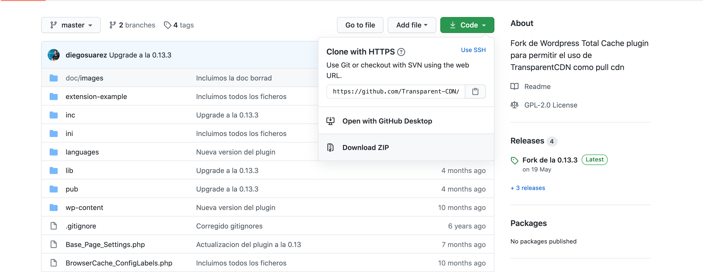
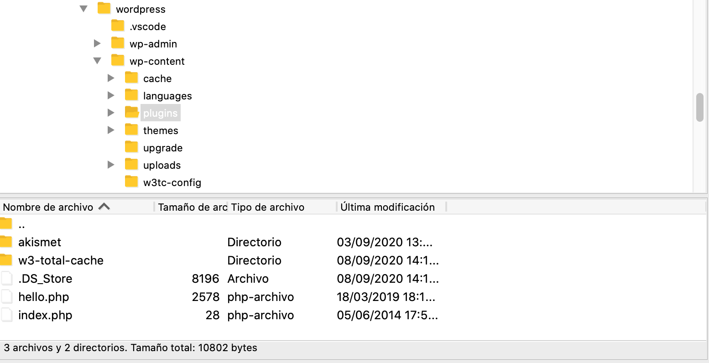
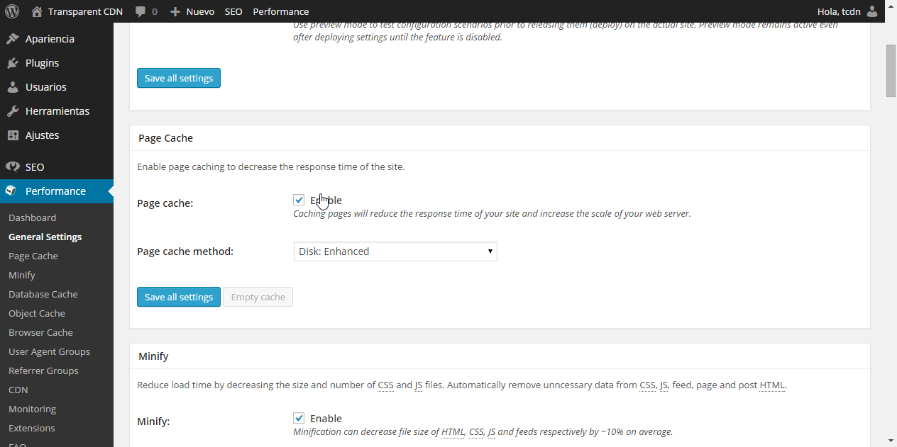
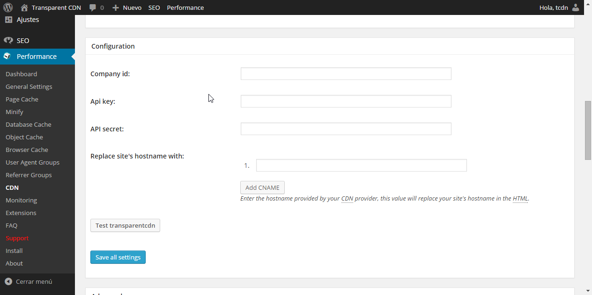
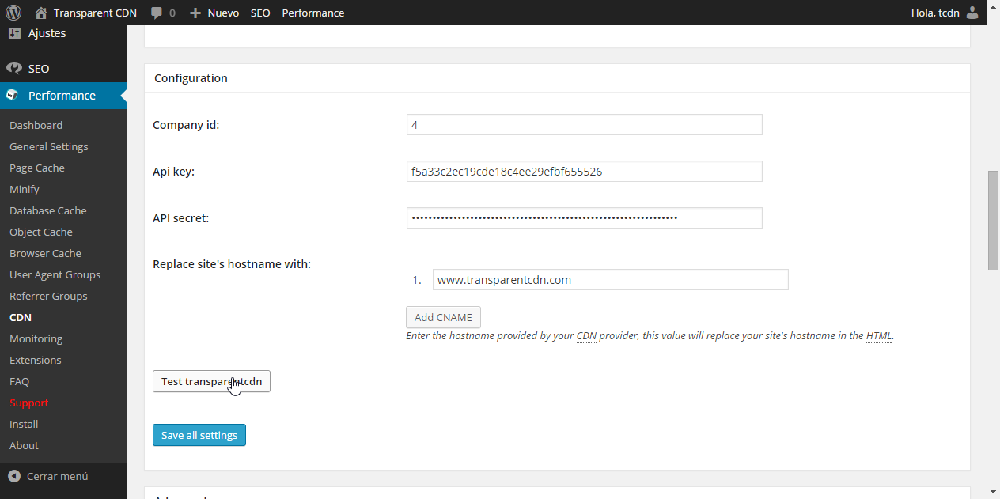

w3tc-transparentcdn
Fork de Wordpress Total Cache plugin para permitir el uso de TransparentCDN como pull cdn. Usa como base la versión 0.9.4.1 de W3TC, aunque esperamos mantener actualizadas las funcionalidades a medida que W3TC actualice.

Instalacion y configuracion
A continuación se incluye una guía para instalar y configurar el plugin.

Descargar el plugin
La última versión del plugin siempre se podrá encontrar en el apartado de releases de la página oficial de github.com de TransparentCDN, en https://github.com/Transparent-CDN/w3tc-transparentcdn/releases . De esta página se podrá obtener el código del plugin, bajo una licencia GPLv2. Para descargarlo, simplemente debe hacer clic en la descarga "Source code (zip)".

Deshabilitar Wordpress total cache. En caso de no tener instalado dicho plugin, puede pasarse al siguiente paso. Si tenemos instalado el plugin de wordpress W3Total Cache, el primer paso es sustituirlo por nuestra version, para lo cual es necesario desactivarlo previamente y luego eliminarlo, tal y como se ve en las siguientes imagenes.

Añadir el plugin a wordpress.
Para ello, accedemos en la interfaz de administrador al menú de plugins y seleccionamos "Añadir nuevo"

En la siguiente pantalla, hacer click en "subir plugin"

Con esto, elegiremos el archivo zip descargado previamente que contiene el directorio del plugin.

Una vez seleccionado, hacemos click en "Instalar ahora".

Otra opción para instalar el plugin para por subirlo desempaquetado al host donde tengamos alojado nuestro site. Para ello debemos descomprimir el archivo y subirlo en el siguiente directorio /wordpress/wp-content-plugins/w3-total-cache. Una vez hecho esto, el plugin estará listo para configurarse.

Configurar el plugin
Una vez instalado el plugin con exito, el siguiente paso es configurarlo. En el menú lateral tendremos un nuevo elemento "Performance". Hacemos click en "General settings".

En esta pantalla, en la sección "FSD CDN", poner check en "Enabled" y seleccionar TransparentCDN. No es relevante el campo que elijamos en el desplegable "CDN".

En la misma pantalla, bajo la configuracion de "Page cache", nos aseguramos de que también esté marcado el "Enable" de "Page cache", guardamos con "Save all settings"

A continuación nos vamos al submenú "CDN" dentro de "Performance". En esta pantalla, configuraremos los parametros de la cuenta de transparent que tengamos asignados. Si no sabe cuales son sus parámetros de acceso, pongase en contacto con el servicio técnico. Una vez que configuremos nuestros parámetros podremos probar que son correctos. Nos aparecerá un mensaje indicándonoslo o, por el contrario, otro mensaje diferente si debemos corregirlos.

Por último, para terminar la configuración, en la seccion "Page cache" bajo "Purge policy", nos aseguramos de marcar todas las secciones que queramos descachear automáticamente cada vez que se publique un nuevo post o se actualice uno existente. 

Una vez seguidos estos pasos, el plugin ya está configurado y funcional. Puede operar con el blog de la manera habitual y el plugin se encargará de notificar los cambios a TransparentCDN para que actualice las copias guardadas.

Notas:
El plugin es una modificación y adaptación de la excelente base del trabajo de W3TC Total cache (https://wordpress.org/plugins/w3-total-cache/).
Pese a las indicaciones de las propias pantallas del plugin, al ser una derivación, todo el posible soporte asociado al plugin lo ofrecerá TransparentCDN, mediante los procedimientos de soporte establecidos con el cliente.

