w3tc-transparentcdn
===================

Fork de Wordpress Total Cache plugin para permitir el uso de TransparentCDN como pull cdn. Usa como base la versión 0.9.4.1 de W3TC,
aunque esperamos mantener actualizadas las funcionalidades a medida que W3TC actualice.

## Instalacion y configuracion

A continuación se incluye una guía para instalar y configurar el plugin.

### Descargar el plugin
La última versión del plugin siempre se podrá encontrar en la página oficial de github.com de TransparentCDN, en https://github.com/Transparent-CDN/w3tc-transparentcdn . De esta página se podrá obtener el código del plugin, bajo una licencia GPLv2. 
Para descargarlo, puede hacerse mediante (enlace) git clonando el repositorio, descargando el zip en el enlace de la izquierda, o solicitándonoslo.
Al final de este paso, debemos tener un archivo .zip que contiene un directorio llamado w3tc-transparentcdn.

* Deshabilitar Wordpress total cache.
En caso de no tener instalado dicho plugin, puede pasarse al siguiente paso.
Si tenemos instalado el plugin de wordpress W3Total Cache, el primer paso es sustituirlo por nuestra version, para lo cual es necesario desactivarlo previamente y luego eliminarlo, tal y como se ve en las siguientes imagenes.

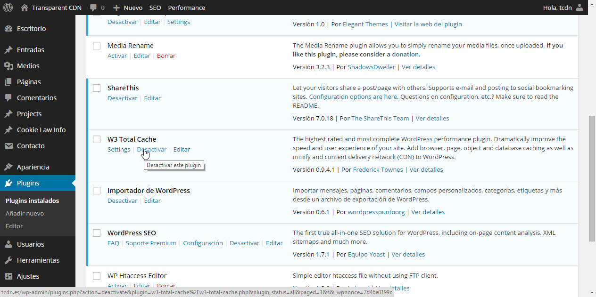

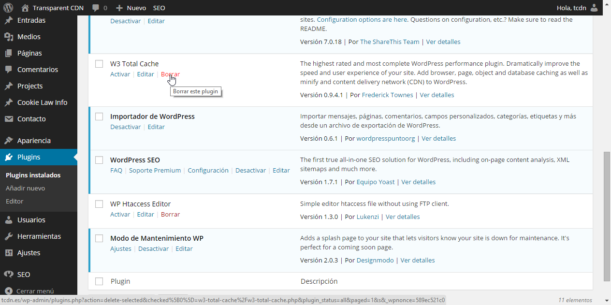

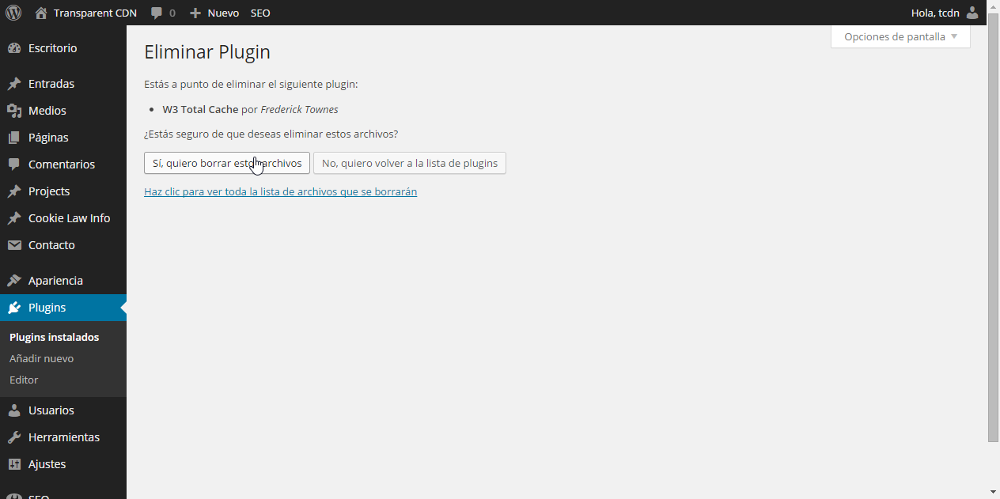

### Añadir el plugin a wordpress.
Para ello, accedemos en la interfaz de administrador al menú de plugins y seleccionamos "Añadir nuevo"

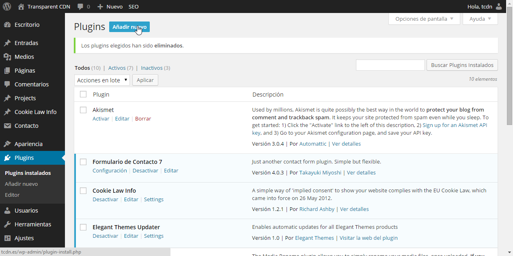

En la siguiente pantalla, hacer click en "subir plugin"

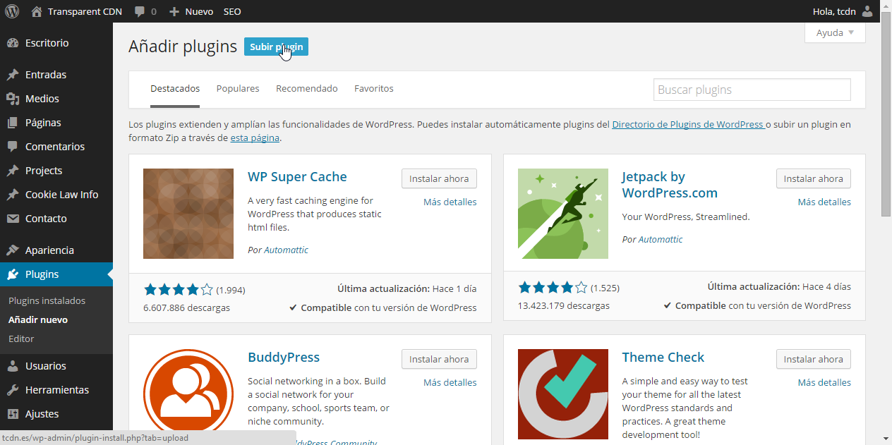

Con esto, elegiremos el archivo zip que contiene el directorio del plugin

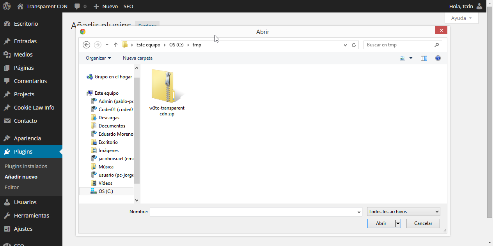

Una vez seleccionado, hacemos click en "Instalar ahora".

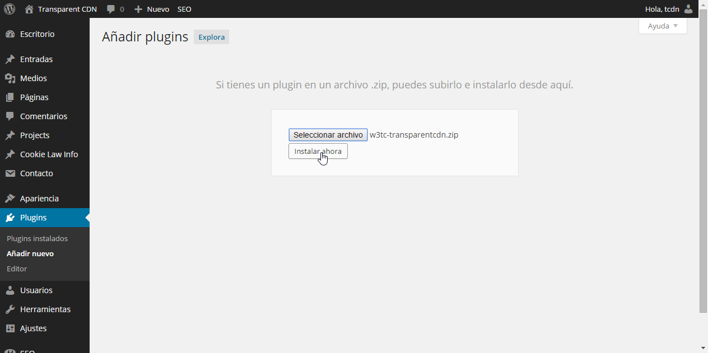

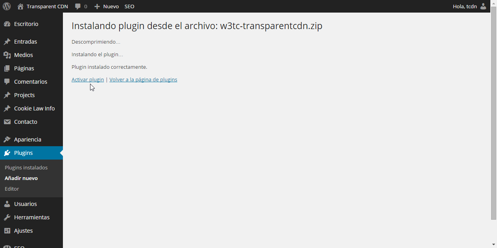

### Configurar el plugin
Una vez instalado el plugin con exito, el siguiente paso es configurarlo. En el menú lateral tendremos un nuevo elemento "Performance". Hacemos click en "General settings".

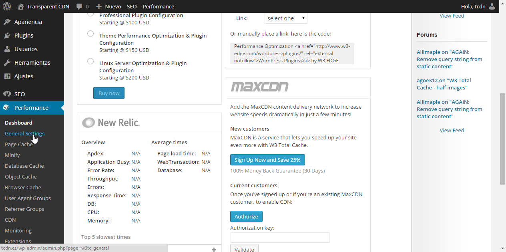

En esta pantalla, en la sección "CDN", poner check en "Enabled" y seleccionar TransparentCDN.

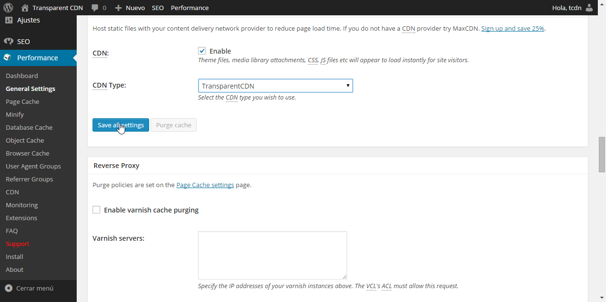

En la misma pantalla, bajo la configuracion de "Page cache", nos aseguramos de que también esté marcado el "Enable" de "Page cache".

Guardamos con "Save all settings", y nos vamos al submenú "CDN" dentro de "Performance". En esta pantalla, configuraremos los parametros de la cuenta de transparent que tengamos asignados. Si no sabe cuales son sus parámetros de acceso, pongase en contacto con el servicio técnico.

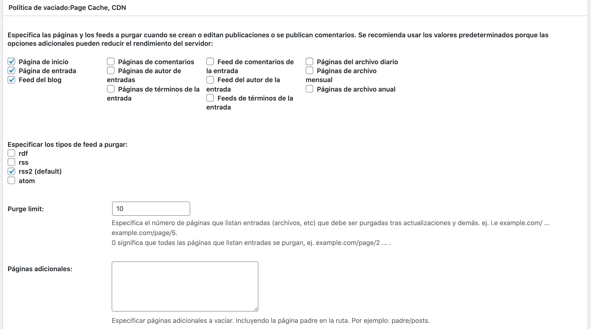

En "Replace site's hostname with" se pondrá el dominio del blog, tal y como está configurado en el DNS. Esto la mayor parte de las veces será la dirección de su sitio web.
Una vez introducidos todos los datos, pulsaremos sobre "Test transparentcdn" para verificar nuestra configuracion. En caso de que todo sea correcto, un mensaje en color verde aparecerá indicando que el test es correcto. Si ha habido algun problema, aparecerá un mensaje de error en color rojo indicando la naturaleza del mismo.

 

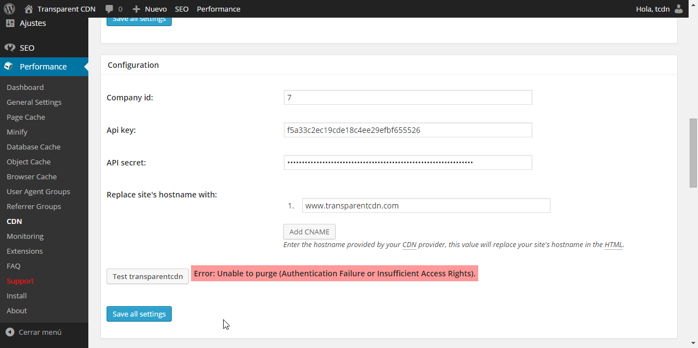

En la misma pantalla, deberemos asegurarnos de marcar la opcion  "Enable mirroring of pages", para que el invalidado se realice siempre que se realicen publicaciones o actualizaciones nuevas.

Una vez seguidos estos pasos, el plugin ya está configurado y funcional. Puede operar con el blog de la manera habitual y el plugin se encargará de notificar los cambios a TransparentCDN para que actualice las copias guardadas. 

## Notas:
* El plugin es una modificación y adaptación de la excelente base del trabajo de W3TC Total cache (https://wordpress.org/plugins/w3-total-cache/). 
* Pese a las indicaciones de las propias pantallas del plugin, al ser una derivación, todo el posible soporte asociado al plugin lo ofrecerá TransparentCDN, mediante los procedimientos de soporte establecidos con el cliente.
